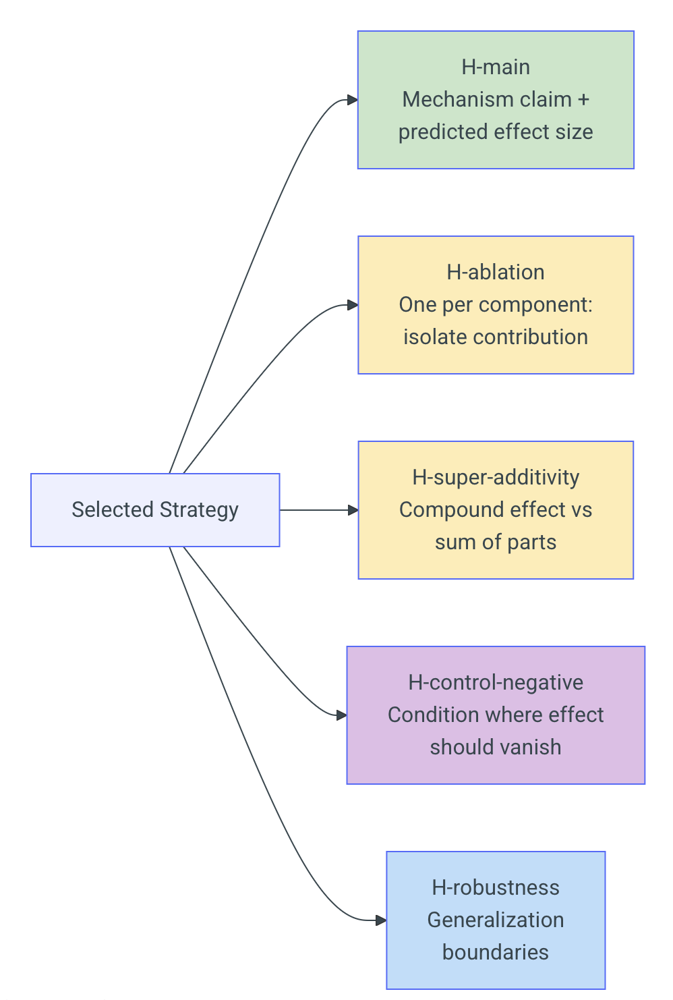
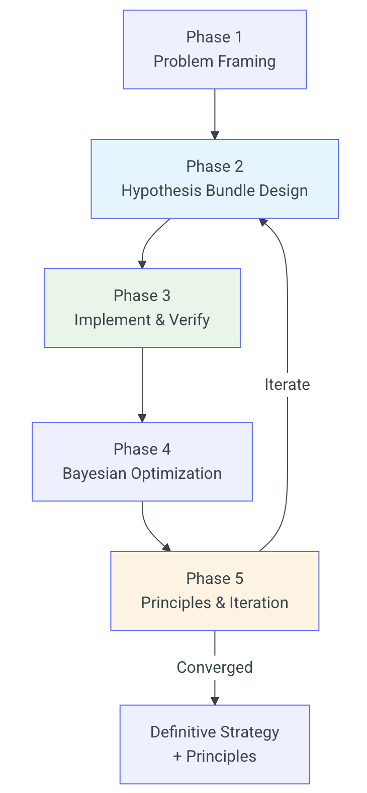

# AI-Native Systems

## Methodology & llm-d

  March 31, 2026

  
    Begin <carbon:arrow-right class="inline ml-1"/>
  

---
layout: default
---

# Objectives

  

---
layout: default
---

# Objectives

  

---
layout: default
---

# Methodology

  

---
layout: default
---

# Progress in Numbers — Since January 2026

inference-sim/inference-sim · inference-sim/training

  

    
28K+

    
lines of code added

    
306 commits across both repos

  

  

    
267

    
pull requests merged

    
inference-sim (266) · training (1)

  

  

    
65

    
hypothesis experiments

    
strategy evolution · hypothesis-archive

  

  

    
Ongoing

    
sim2real experiments

    
admission control & routing · vs real llm-d

  

  

    
BLIS in use across 6 teams

    

      
Our team — AI-Native llm-d research

      
Tal / Udi — AI-Native llm-d research

      
India Research Lab (Arun, Pravein, Pavani) — llm-d agentic routing

      
RedHat NeuralNav — synthetic data source

      
Daniel / Nara — llm-d storage research

      
In proposal — llm-d simulation & capacity planning

    

  

---
layout: default
---

# Outline

  

    {{ i + 1 }}
    {{ item }}
  

 
 

> ### If time permits ...

  

    {{ i + 4 }}
    {{ item }}
  

---
layout: default
---

# Finding 1 — Disaggregation: One Fix, Two Wins

qwen/qwen3-14b · shared 8-inst vs disagg P:2/D:6 · input=512 output=256 · rate=400 · migration sweep 0–50ms · seeds 42/123/456

  

    
341×

    
TTFT P99

    
P:2/D:6 vs shared · rate=400

  

  

    
5.2×

    
E2E P99 improvement

    
decode pool also benefits

  

  

    Why: Each decode request takes ~256 steps. Shared instances make every new prefill wait. Disagg prefill handles each in one step — zero queue.
  

  

    

      
Surprise: two failure modes, one fix

      Shared instances fail two ways: <strong>HOL blocking</strong> (prefill queues behind decode steps) and <strong>KV cache pressure</strong> (decode accumulates blocks, starving new requests). Prefill-only instances (output=1) are structurally immune to both.
    

    

      
Tolerant of migration cost

      Simulated with up to 50ms migration penalty: E2E degrades only <strong>+2.1%</strong>. Migration latency is tiny relative to decode time (~1.8s for 256 output tokens). Real network cost would need to be extreme to matter.
    

    

      
Benefit kicks in above moderate load

      Rate sweep (50→400 req/s): at low rates, shared and disagg TTFT are comparable. Between rate=100 and rate=200, disaggregation pulls decisively ahead — HOL blocking amplifies non-linearly as load grows.
    

    

      
Surprise: use round-robin for prefill

      Compound routing <em>hurts</em> the prefill pool. Prefill-only requests are uniform work units — RR achieves perfect balance with zero scoring overhead.
    

  

  

    Optimal split: P:2/D:6 outperforms P:4/D:4 — 2 prefill instances have 50× spare capacity at rate=400; the extra instances are better used on decode.
  

---
layout: default
---

# Finding 2 — Scaling is Super-Linear Near Saturation

meta-llama/llama-3.1-8b-instruct · 2/4/8 instances · least-loaded routing · FCFS · always-admit · 500 requests · rate=500 (sat.) / rate=100 (sub-sat.) · seeds 42/123/456

  
TTFT P99 at saturation (rate = 500, avg 3 seeds)

  | Instances | TTFT P99 (ms) | vs 8-inst |
  |---|---|---|
  | 2 | ~1,786 | 29.9× worse |
  | 4 | ~441 | 7.4× worse |
  | **8** | **~60** | **baseline** |

  
Sub-saturation control (rate = 100)

  | Comparison | TTFT P99 ratio |
  |---|---|
  | 4 → 8 instances | 1.06× (≈ flat) |

  
All 18 runs pass INV-1 conservation check

  

    7.4×
    from 2× instances (predicted: 2×)
  

  
4 → 8 instances · TTFT P99 · avg across seeds 42, 123, 456

  

    Why super-linear? 
    Excess arrival rate per instance drops <strong>92.5%</strong> (67.6 → 5.1 req/s) when going 4→8. Queue depth — and therefore TTFT — scales with excess rate, not instance count. Near the saturation boundary, adding capacity is disproportionately powerful.
  

  

    Key takeaway: At sub-saturation (rate=100), 4→8 instances yields only 1.06× improvement. The benefit is entirely a saturation-boundary effect — capacity planning must account for this non-linearity.
  

---
layout: default
---

# Finding 3 — KV + Scheduling: Super-Additive

meta-llama/llama-3.1-8b-instruct · H100 TP=2 · 4 instances · 300 req/s · multi-turn · SLO mix 20/40/40% · 48 runs · seeds 42/123/456

  

    
5.8×

    
critical TTFT P99

    
joint vs baseline · KV=1,500

  

  

    
180ms → 4ms

    
latency variance (σ) collapses more predictable, not just faster

  

  

    Throughput cost: <strong>−0.5%</strong> Essentially free.
  

  

    

      Elastic batching 
      Preempts low-priority running requests to make batch slots for critical ones. Protects SLO at the <em>scheduling layer</em>.
    

    

      SLO-aware KV eviction 
      Under KV pressure, evicts sheddable requests' memory blocks first — freeing cache space for critical ones. Protects SLO at the <em>storage layer</em>.
    

  

  
Critical TTFT P99 (ms) · mean 3 seeds · KV = 1,500 blocks

  | Mechanism | Critical TTFT P99 | vs Baseline |
  |---|---|---|
  | Baseline | 464.0 ms | — |
  | KV-aware eviction only | 343.4 ms | 1.35× better |
  | Elastic batching only | 401.0 ms | 1.15× better |
  | **Both together (JOINT)** | **80.0 ms** | **5.8× better** |

  

    Why super-additive? At moderate KV pressure both layers unblock simultaneously — the joint effect is multiplicative, not additive. At abundant or extreme KV, the mechanisms decouple and interaction drops to 1.0×.
  

---
layout: default
---

# Finding 4 — KV Cache Has a Hard Cliff, Not a Slope

llama-3.1-8b · 4 instances · rate=2000 · 200 requests · Gaussian input μ=512 σ=50, output μ=256 σ=50 · block_size=16 · round-robin · FCFS · seeds 42/123/456

  
Seed 42 · 4 instances · rate = 2000

  | KV Blocks | Preempt Rate | TTFT P99 (ms) | E2E P99 (ms) |
  |---|---|---|---|
  | 5,000 | 0% | 474 | 3,609 |
  | 3,000 | 0% | 474 | 3,609 |
  | **2,200** | **0%** | **474** | **3,609** |
  | **2,100** | **17.5%** | **2,305** | **6,194** |
  | 2,000 | 59.5% | 2,860 | 7,072 |

  
Seeds 123 & 456 confirm same cliff location. All 15 configs pass INV-1 conservation. Monotonicity holds across all 3 seeds.

  

    Livelock warning: blocks &lt; 1,000 cause simulation livelock — the cascade prevents forward progress entirely.
  

  

    
4.87×

    
TTFT P99 degradation crossing 100-block boundary

    
474ms → 2,305ms

  

  

    Why binary? 
    Once peak concurrent KV demand exceeds capacity, <code>preempt()</code> evicts running requests and requeues them at <code>ProgressIndex=0</code> — forcing full re-prefill. Each re-prefill consumes blocks again, triggering a cascade. Below the threshold, execution path is identical regardless of extra blocks.
  

  

    Implication: capacity planning requires a safety margin <em>above</em> the cliff — gradual degradation models do not apply here.
  

---
layout: default
---

# Finding 5 — Compound Strategy: Each Lever Has a Job

meta-llama/llama-3.1-8b-instruct · H100 TP=2 · 4 instances · rate=300 (120% capacity) · 1500 requests · SLO mix 20/40/40% · maxRunningReqs=32 · seeds 42/123/456

  
Critical-class TTFT P99 reduction vs baseline · 120% load · 3 seeds

  

    

      

        T2 — Admission only
        10.9%
      

      

        

      

    

    

      

        T3 — Preemption only
        29.3%
      

      

        

      

    

    

      

        T4 — Compound (admission + routing + preemption)
        35.5%
      

      

        

      

    

  

  

    Control T4-uniform (uniform SLO, no class differential): &lt;2% vs baseline — confirms mechanisms are inert without class structure
  

  

    
Admission → cluster health

    
SLO-gated rejection sheds low-priority load before it enters the system. Best cluster-wide P99 in 3/3 seeds. Does not directly protect the critical class.

  

  

    
Routing → cache efficiency

    
Weighted scoring (<code>prefix-affinity:3, queue-depth:2</code>) steers requests toward instances with cached prefixes while avoiding overloaded ones — reducing effective input tokens and queue depth simultaneously.

  

  

    
Preemption → per-class SLO

    
Directly moves critical requests from queue to batch. Dominant lever for critical P99. Fires 103–118× per run under realistic batch pressure (<code>maxRunningReqs=32</code>).

  

  

    Super-additivity is conditional (2/3 seeds). Mechanisms partially substitute when both are strong independently.
  

---
layout: default
---

# Finding 6 — 1% Queue-Depth Weight, 512% Gain

llama-3.1-8b-instruct · 4 instances · prefix-group workload · weighted routing · 200 requests · seeds 42/123/456 · control: no-prefix workload (unique requests)

  
Config A (100:1 prefix:queue) vs Config B (pure prefix-affinity) · prefix workload

  | Seed | TTFT Mean — B worse by | TTFT P99 — B worse by |
  |---|---|---|
  | 42 | **+512.5%** | +429.9% |
  | 123 | +271.7% | +379.9% |
  | 456 | +481.1% | +485.7% |

  
Config B routes all 200 requests to a single instance (Jain fairness: 0.250). Config A distributes across all 4 (Jain: 0.383).

  

    Binary mechanism (Control A3a): Weights 100:1 and 100:0.001 are byte-identical — the tiebreaker is present-vs-absent, not magnitude-dependent. Any positive queue-depth weight delivers the full benefit.
  

  

    Control A3b: Without prefix sharing, D1 (100:1) achieves near-perfect balance (Jain 0.998) vs D2 all-to-one (Jain 0.250) — queue-depth is the sole signal when prefix scores are zero.
  

  

    
512%

    
TTFT improvement from adding 1% queue-depth weight

    
seed 42 · mean latency

  

  

    Implication: Pure prefix-affinity is a degenerate scorer under load — it collapses all traffic onto a single instance. A tiny orthogonal signal is not a tuning knob; it is a <em>liveness requirement</em>.
  

---
layout: default
---

# llm-d Innovation Pipeline

  

---
layout: default
---

# Methodology — Strategy Evolution

  
5 hypothesis arms

  

    
  

  
5-phase discovery loop

  

    
  

---
layout: default
---

# From Optimization to Discovery

Strategy Evolution vs. fitness-based search (SkyDiscover · OpenEvolve · GEPA)

<table class="w-full text-xs border-collapse">
  <thead>
    <tr class="border-b-2 border-gray-300">
      <th class="text-left py-0.5 pr-4 text-gray-500 font-semibold w-1/4">Dimension</th>
      <th class="text-left py-0.5 pr-4 text-gray-600 font-semibold w-5/12">SkyDiscover / OpenEvolve / GEPA</th>
      <th class="text-left py-0.5 text-indigo-700 font-semibold w-5/12">Strategy Evolution</th>
    </tr>
  </thead>
  <tbody class="divide-y divide-gray-100">
    <tr>
      <td class="py-0.5 pr-4 font-medium text-gray-700">Primary signal</td>
      <td class="py-0.5 pr-4 text-gray-600">Fitness score — did the metric improve?</td>
      <td class="py-0.5 text-gray-800">Prediction error — did the mechanism behave as theorized?</td>
    </tr>
    <tr>
      <td class="py-0.5 pr-4 font-medium text-gray-700">Hypothesis structure</td>
      <td class="py-0.5 pr-4 text-gray-600">None — search over mutation space</td>
      <td class="py-0.5 text-gray-800">5 arms pre-committed before implementation; ablations designed upfront</td>
    </tr>
    <tr>
      <td class="py-0.5 pr-4 font-medium text-gray-700">Failure value</td>
      <td class="py-0.5 pr-4 text-gray-600">Discarded — variant pruned from population</td>
      <td class="py-0.5 text-gray-800">High signal — refutation reveals causal model gaps, directs redesign</td>
    </tr>
    <tr>
      <td class="py-0.5 pr-4 font-medium text-gray-700">Tool use</td>
      <td class="py-0.5 pr-4 text-gray-600">Mutation + evaluation only</td>
      <td class="py-0.5 text-gray-800">Agentic — parallel agents, Bayesian optimizer, LLM judges, principles ledger</td>
    </tr>
    <tr>
      <td class="py-0.5 pr-4 font-medium text-gray-700">Durable output</td>
      <td class="py-0.5 pr-4 text-gray-600">Best configuration found</td>
      <td class="py-0.5 text-gray-800">Principles catalog — evidence-backed design rules valid across regime shifts</td>
    </tr>
    <tr>
      <td class="py-0.5 pr-4 font-medium text-gray-700">Goal</td>
      <td class="py-0.5 pr-4 text-gray-600">Optimization</td>
      <td class="py-0.5 text-gray-800">Scientific discovery — understand <em>why</em> mechanisms work, enabling transfer</td>
    </tr>
  </tbody>
</table>

---
layout: default
---

# Methodology — Hypotheses & Agentic Toolchain

  
Each arm requires three elements

  

    

      Quantitative prediction — specific metric + falsifiable threshold (e.g., "&gt;30% TTFT P99 reduction"). No vague claims.
    

    

      Causal mechanism — explicit explanation of <em>why</em> the prediction holds. Forces reasoning before running.
    

    

      Diagnostic clause — "if this fails, it indicates…" directs investigation when outcomes diverge.
    

  

  
Outcome classification

  

    Confirmed
    Partial
    Refuted
  

  
Refuted arms diagnose: <strong>direction wrong</strong> → mechanism misunderstood · <strong>magnitude wrong</strong> → strength model off · <strong>regime wrong</strong> → conditional applicability

  
Agentic toolchain 

  

    Multi-LLM design review — Claude Opus, GPT-4o, and Gemini review candidates independently before a line of code is written.
  

  

    Convergence-gated verification — Design (5 perspectives) → Code (5) → Findings (10). Each gate must converge before advancing.
  

  

    Parallel arm execution — all 5 arms run across 3+ seeds simultaneously via dispatched agents.
  

  

    Bayesian optimization — <code>gp_minimize</code> tunes parameters automatically once H-main is confirmed.
  

  

    Principles ledger — never-delete log of prediction accuracy. Durable output is the principles catalog, not any single configuration.
  

---
layout: default
---

# The Role of Claude & LiteLLM

  
Claude

  

    
Development environment

    All BLIS engineering — code, tests, PRs, branch management — runs inside Claude Code.
  

  

    
Agentic discovery loop

    Strategy Evolution runs as Claude Code plugins: parallel arm dispatch, convergence gates, Bayesian optimization, principles ledger.
  

  
LiteLLM

  

    
Unified model access

    Single OpenAI-compatible API across Claude Opus, GPT-4o, and Gemini 2.5 Flash — the three judges in every convergence review.
  

  

    
Enforces judge independence

    Each model sees the same prompt with no visibility into other responses — preventing consensus bias.
  

  

    
Glue in the agentic loop

    Sits between Claude Code and every non-Claude call — retry, load balancing, cost tracking — so the pipeline scales as the model roster grows.
  

